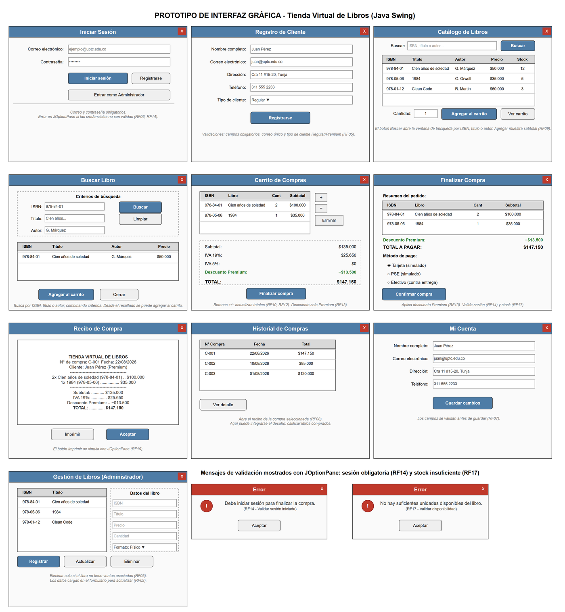

# Tienda Virtual de Libros

Proyecto de Programación II (UPTC). Una aplicación de escritorio en Java para una librería que quiere vender por internet: maneja el catálogo de libros, el registro de clientes, el carrito de compras y la generación del recibo al finalizar la compra.

## ¿Qué usa?

- Java 21 y Swing (JFrame, JPanel, JTable)
- Arquitectura en capas: presentación, negocio y persistencia
- Persistencia con archivos JSON y TXT (más adelante se conectará una base de datos con JDBC)

## Prototipo de la interfaz



## Guía para el equipo

Toda la explicación del proyecto (cómo funciona, qué hace cada paquete, división del trabajo y cómo usar Git) está en: [docs/guia-proyecto.md](docs/guia-proyecto.md)

## Estructura del código

```
src/co/uptc/edu/
├── gui/            # las ventanas de la aplicación
├── negocio/        # clases del modelo (Libro, Cliente, Compra, Carrito...)
├── persistencia/   # guardar y leer archivos JSON y TXT
├── util/           # validaciones y constantes
└── principal/      # clase con el main
```

## Cómo probarlo

1. Clonar el repositorio
2. En Eclipse: File > Import > Existing Projects into Workspace
3. Ejecutar `Principal.java` (Run As > Java Application)

## Integrantes

- Juan Pablo Barrero (@kanonufo)
- Liz Rojas
- Alexander Manrique
